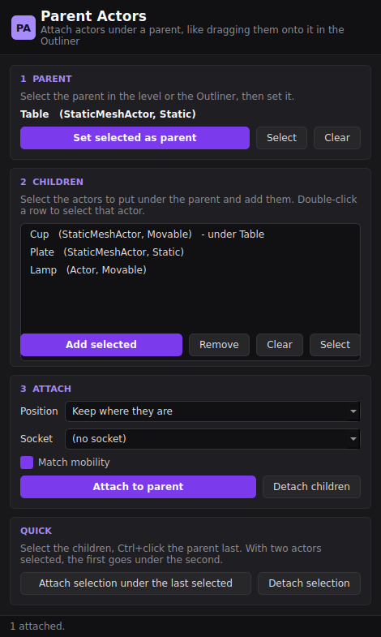

# Parent Actors

A single-file Python tool for **Unreal Engine 5.6**. It attaches actors (meshes, lights, Blueprints, anything with a root component) under a parent actor. The result is the same as dragging them onto the parent in the Outliner, but you can do many at once from a small panel. When Unreal can't attach an actor, the panel says why.



## Requirements
- Unreal Engine 5.6 with the **Python Editor Script Plugin** enabled.
- PySide6 for the panel. It uses the same per-user install as World Performance Audit and Snow Painter (offered on first run). Without it, use the Python functions below.

## Run it
- **Paste:** *Window → Output Log*, Python mode, paste the whole `parent_actors.py`, press Enter.
- **File:** *Tools → Execute Python Script…*.
- **Module:** copy it to `<Project>/Content/Python/` and run `import parent_actors; parent_actors.show()`.

## Workflow
1. **Parent:** select the parent in the viewport or the Outliner and click **Set selected as parent**. It stays set while you select other things. If several actors are selected, the last one becomes the parent.
2. **Children:** select the actors to put under it and click **Add selected**. Repeat to add more.
   - The parent itself and actors already in the list are skipped.
   - Double-click a row to select that actor in the level.
   - **Remove** drops the highlighted rows; **Clear** empties the list.
3. **Attach to parent:** attaches every listed actor. One **Ctrl+Z** undoes the whole attach.
   - **Position:** *Keep where they are* (the default) leaves the children in place. *Snap onto the parent* moves them onto the parent's pivot, or onto the chosen socket, and keeps their scale.
   - **Socket:** lists the sockets of the parent's mesh (static mesh sockets, bones). Leave it on *(no socket)* for a plain attach.
   - **Match mobility:** Unreal can't attach a Static actor under a Movable or Stationary one. When this is ticked, such a child gets the parent's mobility. When it's unticked, the child is skipped and the panel says why.
4. **Detach children:** detaches the listed actors from whatever they're attached to. They keep their place in the world.

**Quick:** for one-off parenting, select the children, Ctrl+click the parent **last**, and click **Attach selection under the last selected**. With two actors selected, the first goes under the second. **Detach selection** detaches the selected actors.

The status line and the Output Log say what was attached and what was skipped, and why: the actor was deleted, it's already attached there, it would make a loop, it's in a different level, or it has no root component.

## Python functions
```python
import parent_actors as pa
pa.attach_selected()                  # all selected actors under the last selected one
pa.attach_selected(keep_world=False)  # ...snapped onto it
pa.detach_selected()
pa.set_parent(); pa.add_children(); pa.attach_children(socket="Top")
pa.attach([child_a, child_b], parent, keep_world=True, socket="", match_mobility=True)
```
Defaults are in `CONFIG` at the top of the script.

## Changes
- **1.0.0:** first version.
