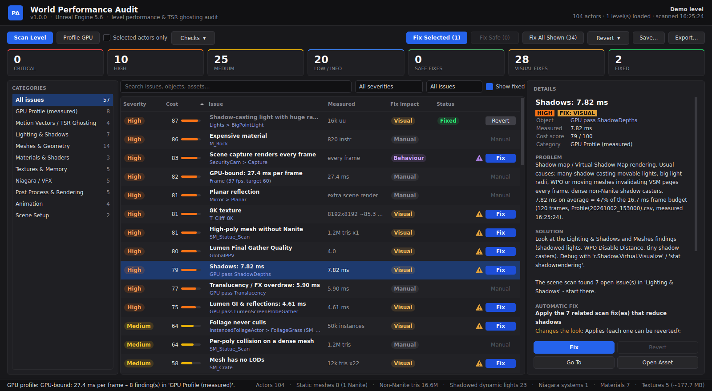

# World Performance Audit

A single-file Python tool for **Unreal Engine 5.6**. It scans the open level for setups that cost performance, measures the real frame with Unreal's GPU profiler, and gives you a **Fix** button on each finding. Every fix can be reverted.



- **Scan Level:** 48 checks covering lighting & shadows, Virtual Shadow Map invalidation, Nanite/LODs, WPO, culling, textures and the streaming pool, shader cost, Niagara, Lumen / distance fields, post process, scene captures, animation, and motion vectors / TSR ghosting. Findings are ranked by an estimated cost score.
- **Profile GPU:** records 120 frames with the CSV profiler. It tells you whether you're GPU-, game-thread- or render-thread-bound, lists the expensive GPU passes and game/render-thread work, and links each one to the scan findings that reduce it.
- **Before/after proof:** each new profile is compared with the previous one, and fixes that bought nothing measurable can be taken back in one click. Optionally, visual fixes are wrapped in before/after viewport screenshots with a wipe and difference view.
- **Profile Sequence:** profiles the open Level Sequence shot by shot, and fixes spawnables on their template inside the sequence so the fixes stick.
- **Fix / Fix Selected / Fix Safe / Fix All Shown:** no popups. A ⚠ next to Fix means *this might change the look* (amber) or *behaviour* (purple).
- **Revert:** every fix records the old values in `Saved/PerfAudit/fix_journal.json`, so you can revert one fix or all of them at any time, even after saving or restarting.

## Requirements
- Unreal Engine 5.6, with the **Python Editor Script Plugin** and **Editor Scripting Utilities** plugins enabled.
- Qt for Python for the UI. On first launch the tool offers to install **PySide6-Essentials** into a per-user folder outside your project: `%LOCALAPPDATA%\UnrealWorldPerfAudit\py311\site-packages`. That needs internet access. PyQt6, PySide2 and PyQt5 also work if one is already installed. Without Qt the tool runs in text mode (Output Log + HTML report).

## Run it
**A. Paste:** open *Window → Output Log*, set the dropdown next to the input box to **Python** (not *Cmd*, not *Python (REPL)*), paste the whole `world_perf_audit.py` and press Enter.

**B. One line:** paste this into the Output Log in Python mode. It downloads the v1.0.0 release, **checks its SHA-256** and only then runs it:
```python
import urllib.request as u, hashlib as h; s = u.urlopen("https://raw.githubusercontent.com/PhiLLAnt89/PhiLL/v1.0.0/world_perf_audit." + "py").read(); assert h.sha256(s).hexdigest() == "99acfa40d398795b72ec2a6e4b1d1d86a20ef5746e52d3ebf35731993221d80c", "checksum mismatch - not running it"; exec(s.decode("utf-8"), {"__name__": "__main__"})
```
**C. File:** *Tools → Execute Python Script…* and pick `world_perf_audit.py`.

**D. Module:** copy the file to `<Project>/Content/Python/` and run `import world_perf_audit; world_perf_audit.show()`.

## Workflow
1. **Scan Level.** Pick a category on the left and select a row to read the problem, the solution and exactly what the fix changes.
2. **Profile GPU** with the viewport visible and Realtime on (Ctrl+R). For final numbers, profile in PIE or a Standalone game; editor numbers include editor overhead. For a cinematic, open it in Sequencer and click **Profile Sequence** instead.
3. Click **Fix** on single rows, or select rows and use **Fix Selected**. **Fix Safe** applies only fixes with no visual change; **Fix All Shown** applies the whole filtered list. Tick **Before/after shots** first if you want screenshots of visual fixes.
4. Check the viewport, or select a fixed row and click **Before / After**. Use **Revert** on anything you don't like (row button, *Revert ▾*, or *Revert ALL*).
5. **Profile GPU** again. The pinned *Since the last profile* row shows what changed. Its **Revert** takes back the fixes whose GPU pass didn't get faster.
6. **Save…** (Unreal's own Save Content dialog). Nothing is saved before this.

### Before/after proof
- **Profiles:** every Profile GPU on the same level is compared with the previous one: frame, GPU, game thread, render thread, and the GPU passes that changed most. It lists the fixes applied in between and the ones whose pass got no faster (within noise: 0.05 ms or 2%).
  - Fixes that only change quality levels the editor isn't running at aren't judged.
  - A fix can still help another view, quality level or the packaged game, so the Revert is offered, never automatic.
- **Screenshots:** with **Before/after shots** ticked, a batch of fixes that might change the look runs as: screenshot → fixes → 2 s to settle → screenshot.
  - Files are saved in `Saved/PerfAudit/Shots`.
  - **Before / After** shows a wipe (drag on the image), each image alone, and a 4x difference image with the share of pixels that changed.
  - *Safe* fixes are applied immediately, without screenshots.

### Sequencer
- **Profile Sequence** steps through the shots of the sequence open in Sequencer: cinematic shots, else camera cuts, else four equal parts. For each shot it locks the camera cut to the viewport, waits 2 s, and captures 60 frames at the shot's middle frame.
  - Each shot becomes a finding under *Sequencer Shots (measured)*, with a Fix for its most expensive passes. **Go To** jumps Sequencer to that shot.
  - At the end, Sequencer parks on the worst shot and the level is scanned there, so that shot's spawnables are included.
  - **Stop** cancels it and restores the playhead, the camera lock and the profiler settings.
- **Spawnable templates** of the open sequence (and its shots) are scanned. Light, WPO, overlap, scene-capture, decal and animation fixes are applied to the template inside the sequence asset, so they survive the next spawn. Save the sequence to keep them.

## Fix safety
| Label | Meaning |
|---|---|
| **Safe** | No visual change (e.g. a texture streams instead of always being resident) |
| **Visual** ⚠ | Changes the look (light radius, cull distances, Nanite/LOD rebuilds, post-process overrides…) |
| **Behaviour** ⚠ | Can change gameplay/runtime behaviour (mobility, overlap events, scene captures, animation ticking, deleting duplicate actors) |

- **Revertable:** every fix journals its old values, including asset rebuilds (Nanite on/off, generated LODs, distance-field resolution), ini edits and console variables.
- **Quality levels:** console-variable fixes (volumetric fog grid, translucency resolution) go to `Config/DefaultScalability.ini`, only for the levels in `scalability_fix_levels` (default Low/Medium/High). Epic and Cinematic keep their look. Levels that are already cheap enough, or where the feature is off, are skipped. The change is visible right away only when the editor runs at one of those levels (*Settings > Engine Scalability Settings*).
- **Effect Type fix:** creates `/Game/PerfAudit/ET_PerfAudit_DistanceCull` once (distance culling at 150 m, re-checked continuously, culled FX resume when you come closer) and assigns it. Revert unassigns it; the asset stays. Tune the asset to change it for every system that uses it. Deleted duplicate actors and generated *skeletal* LODs can only be undone with Ctrl+Z or source control; the tool says so on those rows.
- **Never touched automatically:** materials. Turning on *Output Depth and Velocity* breaks soft particles that use DepthFade. Lit particle lighting modes are also left alone.
- **Protected FX textures:** textures used by particle materials get no automatic mip / compression / power-of-two changes, which would break flipbooks and atlases.
- **Shared assets:** asset fixes change the asset for every level that uses it.
- **Fixes made by the first release:** *Revert ▾ → Undo fixes made by the previous version* rebuilds the old values from `Saved/Logs`.

## What gets scanned
The persistent level and **every loaded sublevel** (visible or hidden). That includes Level Instance contents, child actors and currently spawned Sequencer spawnables; these last three are scanned for their assets, but actor-level fixes aren't offered on them because the change wouldn't stick. The spawnable **templates** of the sequence open in Sequencer get those fixes instead.

**Not scanned:** unloaded sublevels (the header lists them), unloaded World Partition regions, and actors spawned only at runtime.

## Configuration
Thresholds are in the `CONFIG` dict at the top of the script. Examples:
- **Frame and checks:** `target_fps` (the frame budget used for GPU findings), `max_light_radius`, `high_poly_tris`, `texture_warn_size`, `wpo_disable_distance`.
- **Profiling:** `profile_frames`, `shot_profile_frames`.
- **Fixes:** `scalability_fix_levels`, `effect_type_cull_distance`.
- **Screenshots:** `before_after_shots` (the checkbox's start state), `shot_width` / `shot_height`.

## Text mode / scripting
```python
import world_perf_audit as w
w.scan(); w.print_report()            # report in the Output Log
w.fix(12); w.revert(12)               # one issue by id
w.fix_all()                           # Safe fixes only; fix_all(include_visual=True) for everything
w.revert_all()                        # everything in the journal, also from earlier sessions
w.profile_gpu(on_done=lambda issues, err: w.print_report())
w.profile_sequence(on_done=lambda issues, err: w.print_report())   # sequence open in Sequencer
w.fix_with_screenshots([w._issue_by_id(12)])   # before/after shots in Saved/PerfAudit/Shots
w.cancel_job()                        # stop a running profile
w.export_report()                     # HTML (or a .csv path)
```

## Security
- **The one-liner** checks the downloaded file's SHA-256 against the value published with the release. Never run a version from a link whose hash you can't verify: GitHub serves fork commits under the original repo's URL.
- **pip install:**
  - **What gets installed:** `PySide6-Essentials>=6.5,<7`, prebuilt wheels only (`--only-binary=:all:`, so no build scripts run), straight from PyPI.
  - **pip settings are ignored:** `--isolated` means `PIP_*` environment variables and pip config files can't redirect the index.
  - **Where it goes:** a per-user folder outside the project, added to `sys.path` without running `.pth` files. Delete the folder to uninstall.
- **What the tool writes:**
  - `Config/DefaultEngine.ini`: one renderer key (the velocity fix), plus reverting 1.0.0's console-variable fixes. `Config/DefaultScalability.ini`: three console variables in `[ShadowQuality@N]` / `[EffectsQuality@N]` sections. All validated, and never if the file is read-only. Check them out of source control first.
  - `Saved/PerfAudit/` (journal, reports, before/after screenshots).
  - Assets and levels: only through Fix, only in `/Game` and the project's own plugins (the Effect Type fix creates one asset in `/Game/PerfAudit`), and nothing is saved until you click Save.
- **The journal is untrusted on revert.** Only known properties, setters, enums, console variables and ini keys, with validated values, on project content, are replayed. Console commands are limited to `r.<name> <number>`, `csvprofile frames=<n>`, `csvprofile stop` and `HighResShot <w>x<h>`.
- **Restoring the old version's fixes** only reads the old version's own `LogPython: [PerfAudit] Fixed` lines. It skips asset names that match more than one asset, and never removes LODs it didn't generate.
- **Exports and UI text:** HTML reports and Qt text escape asset and actor names, and CSV exports neutralise spreadsheet formulas.

## Tests
The tests run the whole tool, UI included (rendered offscreen), against `tests/mock/unreal.py`, a small fake of the Unreal Python API:
```
pip install PySide6-Essentials pyflakes
python tests/run_all.py
```
CI runs the same on every push (`.github/workflows/tests.yml`). The mock checks the tool's logic, not Unreal itself, so do a manual pass in the editor before each release (see [RELEASE.md](RELEASE.md)).

## Known limitations
- Written against the UE 5.6 Python API. A few calls differ between engine versions; a check that fails is skipped and reported in the Output Log, and the scan continues.
- GPU pass names come from Unreal's CSV stats. A pass the tool doesn't recognise is listed under its raw name, with a pointer to `ProfileGPU`.
- The cost score is a heuristic for ranking, not a measurement. Use **Profile GPU** for real numbers.
- **Profile Sequence** measures the middle frame of each shot (paused), not the whole shot playing.
- **Not detectable from Python:**
  - which Blueprints tick every frame (the game-thread findings point at `stat game` / Unreal Insights);
  - whether GPU Niagara emitters have sensible fixed bounds.
- Before/after screenshots need the level viewport visible.

See [CHANGELOG.md](CHANGELOG.md).
